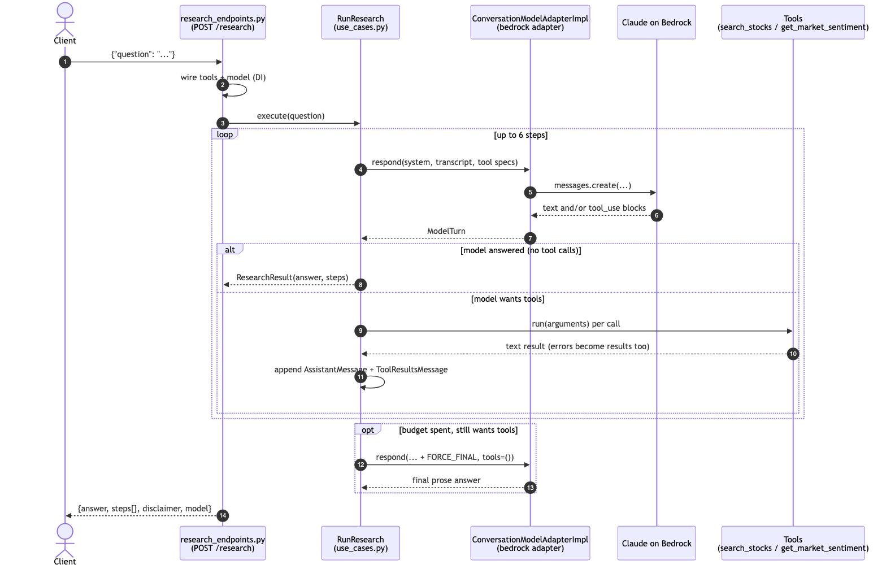
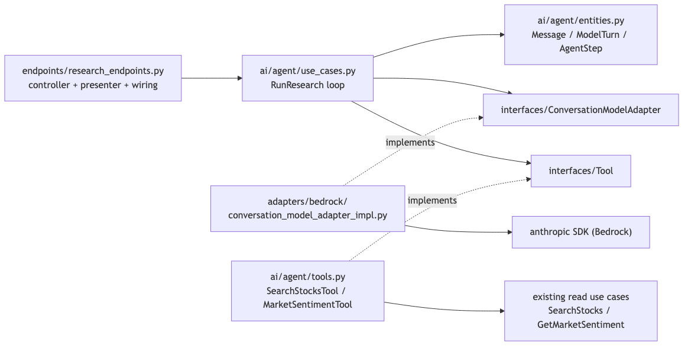

# Research agent — flow diagrams

## Request flow (`POST /research`)



## Layering (dependency rule)



Sources are the `.mmd` files beside the images. Regenerate after editing:

```sh
npx -y @mermaid-js/mermaid-cli -i research_agent_flow.mmd -o research_agent_flow.png -w 1600 -b white
npx -y @mermaid-js/mermaid-cli -i research_agent_layers.mmd -o research_agent_layers.png -w 1600 -b white
```
